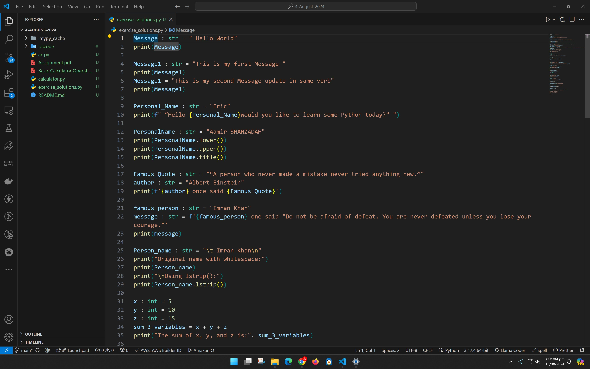
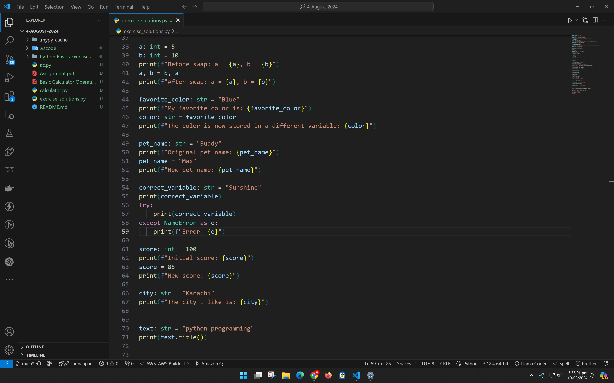
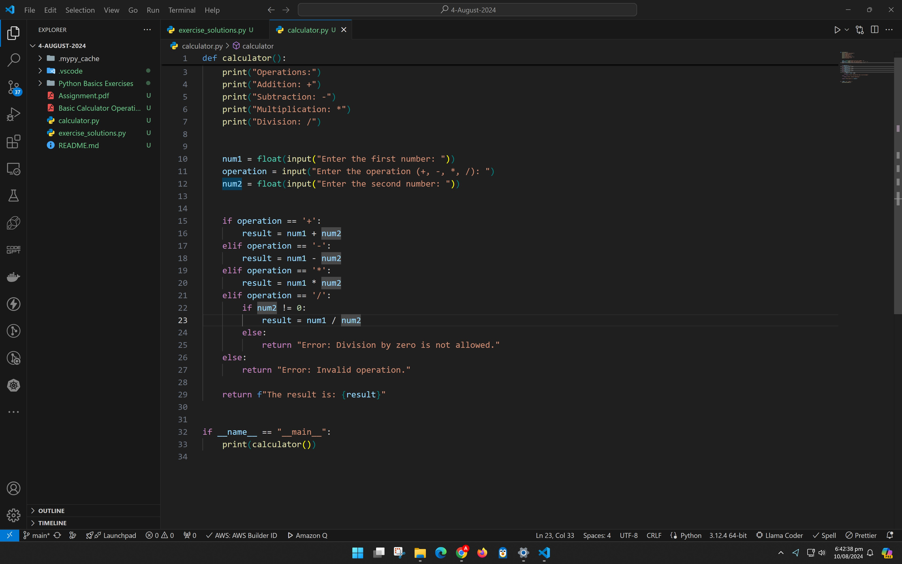
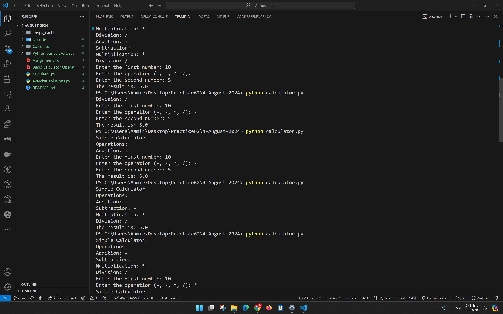
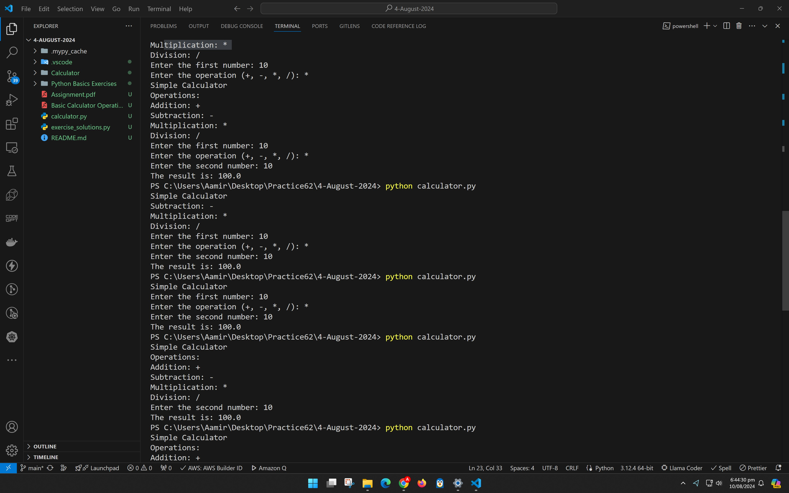
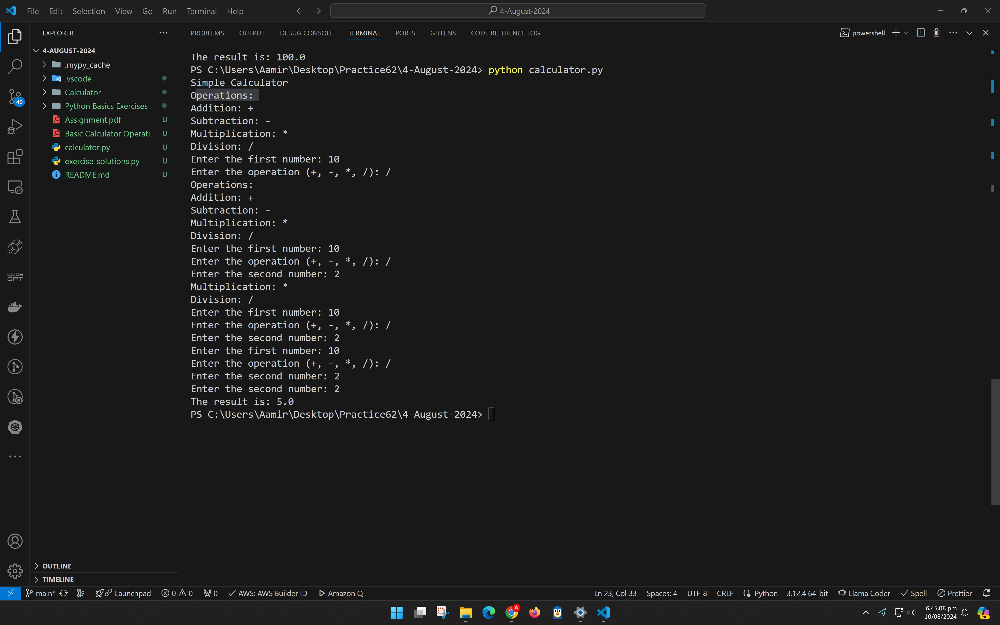

## exercise_solutions.py

```
Message : str = " Hello World"
print(Message)

Message1 : str = "This is my first Message "
print(Message1)
Message1 = "This is my second Message update in same verb"
print(Message1)

Personal_Name : str = "Eric"
print(f" “Hello {Personal_Name}would you like to learn some Python today?” ")

PersonalName : str = "Aamir SHAHZADAH"
print(PersonalName.lower())
print(PersonalName.upper())
print(PersonalName.title())

Famous_Quote : str = "“A person who never made a mistake never tried anything new.”"
author : str = "Albert Einstein"
print(f'{author} once said {Famous_Quote}')

famous_person : str = "Imran Khan"
message : str = f'{famous_person} one said "Do not be afraid of defeat. You are never defeated unless you lose your courage."'
print(message)

Person_name : str = "\t Imran Khan\n"
print("Original name with whitespace:")
print(Person_name)
print("\nUsing lstrip():")
print(Person_name.lstrip())

x : int = 5
y : int = 10
z : int = 15
sum_3_variables = x + y + z
print("The sum of x, y, and z is:", sum_3_variables)


a: int = 5
b: int = 10
print(f"Before swap: a = {a}, b = {b}")
a, b = b, a
print(f"After swap: a = {a}, b = {b}")

favorite_color: str = "Blue"
print(f"My favorite color is: {favorite_color}")
color: str = favorite_color
print(f"The color is now stored in a different variable: {color}")

pet_name: str = "Buddy"
print(f"Original pet name: {pet_name}")
pet_name = "Max"
print(f"New pet name: {pet_name}")

correct_variable: str = "Sunshine"
print(correct_variable)
try:
    print(correct_variable)
except NameError as e:
    print(f"Error: {e}")

score: int = 100
print(f"Initial score: {score}")
score = 85
print(f"New score: {score}")

city: str = "Karachi"
print(f"The city I like is: {city}")


text: str = "python programming"
print(text.title())


mixed_case_text1: str = "PyThOn ProGrAmMiNg"
print(mixed_case_text1.lower())


mixed_case_text: str = "PyThOn ProGrAmMiNg"
print(mixed_case_text.upper())


temperature: int = 25
print(f"The current temperature is {temperature} degrees.")


poem: str = """Twinkle, twinkle, little star,
How I wonder what you are!
Up above the world so high,
Like a diamond in the sky.
"""
print(poem)

```





## Basic Calculator Operations in Python

```
def calculator():
    print("Simple Calculator")
    print("Operations:")
    print("Addition: +")
    print("Subtraction: -")
    print("Multiplication: *")
    print("Division: /")
    
    
    num1 = float(input("Enter the first number: "))
    operation = input("Enter the operation (+, -, *, /): ")
    num2 = float(input("Enter the second number: "))
    
  
    if operation == '+':
        result = num1 + num2
    elif operation == '-':
        result = num1 - num2
    elif operation == '*':
        result = num1 * num2
    elif operation == '/':
        if num2 != 0:
            result = num1 / num2
        else:
            return "Error: Division by zero is not allowed."
    else:
        return "Error: Invalid operation."

    return f"The result is: {result}"


if __name__ == "__main__":
    print(calculator())

```








